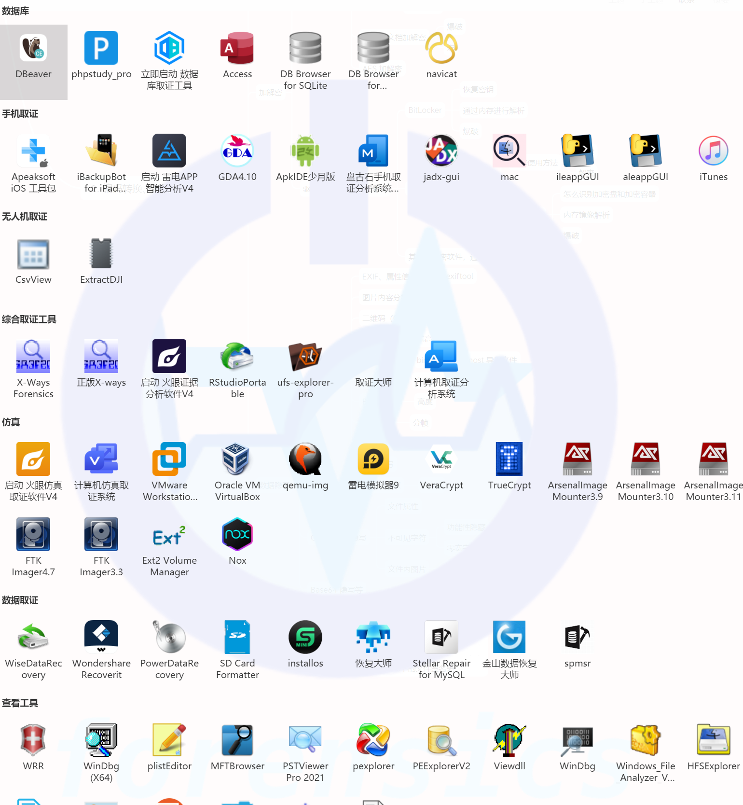

# 电子取证新生入门指南

编者：Q1anfang2

​		电子取证与其他部门相比具有独特性，并且在未来的工作中将愈加重要。随着电信诈骗、网络赌博等网络犯罪的增多，犯罪证据的形式逐渐从传统的指纹、脚印等物理证据转变为手机、电脑等电子设备中的数据，即网络空间中的虚拟证据。这些虚拟证据与传统证据在法律上具有同等的诉讼效力，成为了当代的“证据之王”。电子取证部门以信息收集和证据分析为核心，通过举办专业竞赛、搭建实训平台、提供线下培训等多种途径，帮助取证爱好者提升技能；为网络安全和刑事侦查工作培养和输送人才，助力打击和预防各类网络犯罪，为社会的平安稳定保驾护航。

## 前言（随便写一写对电子数据的看法）

​		电子数据取证在公安大学有着举足轻重的地位，本科为此开设了专门的微专业课程，还设置了数据侦查实验班；在研究生阶段网安和刑科都设置了电子数据取证的相关方向。（虽然没有一个取证比赛能对保研加分产生帮助，但是可能会提供就业机会）

​		对于电子数据取证也有着专门对口的工作岗位，在近两年各地网安部门和刑侦部门都举办了很多取证的联赛，由此可见电子数据取证的地位愈发重要。网络特警队也是这两年才设立这个部门，同时也反映了我校对于该竞赛方向的人才不足和比赛欠缺，为此希望电子数据取证能够有更多的师弟师妹参与起来，在提升自己的同时，打击违法犯罪行为。

## 所需知识

学科知识：

- python、java、php、C等语言的代码要能看懂
- 计算机网络知识

CTF基础：

- 常见的**密码**加密和解密
- 各种**隐写**术
- 简单的**逆向**（python、java、exe、apk等）
- 以解密为主的**流量分析**
- **内存镜像**分析

取证基础：

- **计算机**分析（windows操作系统、mac操作系统、linux操作系统）
- **服务器**网站的搭建（linux操作系统、windows server操作系统）
- **数据库**分析和简单的sql语句查询
- **手机**分析（安卓和苹果操作系统）
- **数据恢复**和二进制分析
- **物联网**设备和智能设备（无人机、智能汽车、智能家具等）

---

*science上网*：上网都不会还学什么学

---

#### 建议学习路线：

阶段一：misc->web->密码和逆向

阶段二：计算机->手机->服务器和网站->数据恢复->物联网设备

阶段三：渗透和应急响应->取证

#### 建议刷题方法：

先做题按照题解复现->整理好自己的知识点手册->不看题解看知识点手册做题

#### 推荐刷题靶场：

1.蓝队ctf：https://cyberdefenders.org/blueteam-ctf-challenges

2.甘肃政法大学靶场：https://forensics.didctf.com

3.长安杯赛题：http://changancup.com/index.php?c=category&id=14

4.美亚杯赛题：https://www.meiyacup.com/Mo_index_gci_36.html

## 工具

虚拟机：VMware虚拟机工具、雷电模拟器、Nox模拟器、WSL

自动化分析工具：弘连的火眼分析、盘古取证工具、美亚的取证大师、龙信取证工具、平航取证工具等（前面这些都是企业工具无破解版，需要自行联系老师来进行获取或每次比赛时白嫖试用）；下面都是开源免费的：Autopsy、

镜像挂载：VeraCrypt、FTK Imager、ArsenalImageMounter、Xways、

数据库分析：Navicat、DB Browser for SQLite、小p面板

查看工具：注册表查看工具、plist查看工具、二进制查看工具等（遇到没见过的文件，多搜一搜查一查，然后找一找工具）

隐写工具：挺多的，做做misc题配一下环境吧

流量取证工具：Network Miner、WireShark

内存取证工具：Volatility（包括2和3版本）

加密解密工具：Passware Forensic Kit、ARCHPR、CyberChef等

最强辅助工具：Chat-gpt（2024年了不会有人不知道gpt是啥吧）

---

取证工具一览（好多是用不上的，做题时遇到什么工具再下载配置就行）：

## 结语

​		上面的内容就是让初学者对电子数据取证有一个宏观的了解，没有写长篇大论的知识讲解，都是精简之后的内容，我个人认为是比较适合入门了解什么是电子数据取证的。文章中的知识点每一个都是可以写很多文章才能说清楚的，但是更鼓励初学者自行上网查找资料，培养电子数据取证自学的能力。如果日后有时间，再对每一个知识点进行详细讲解和实战分析。

